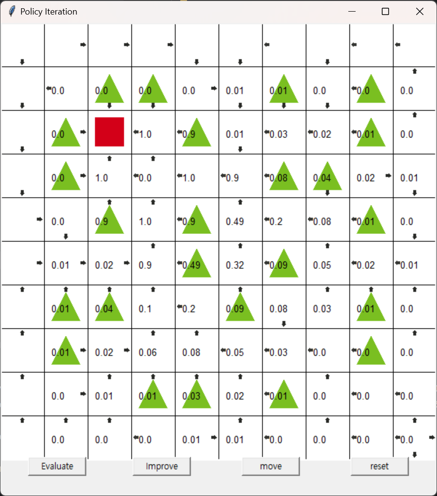
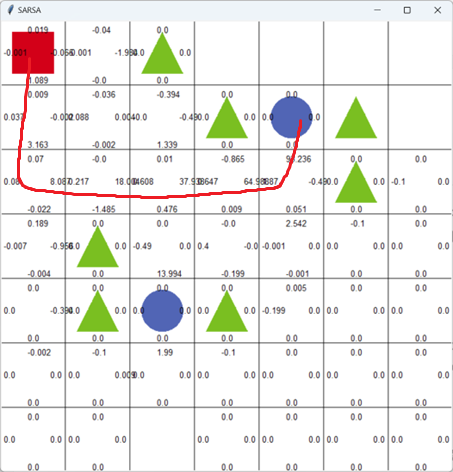
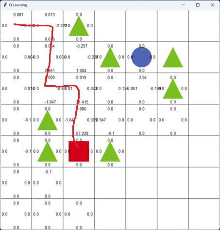
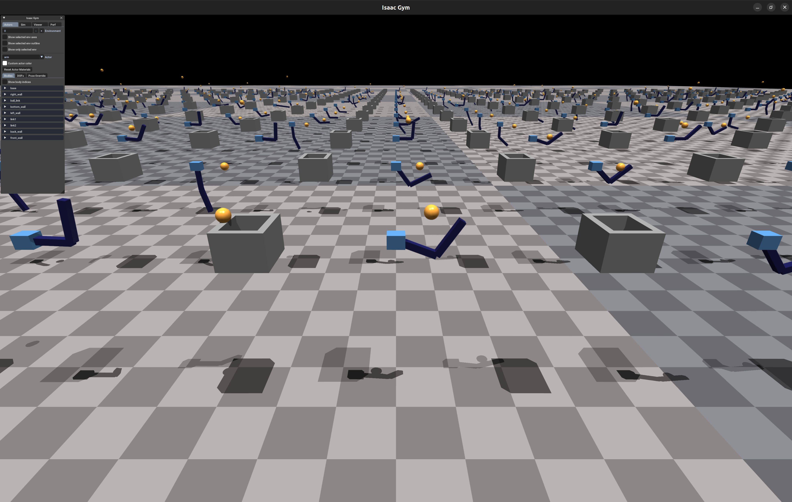
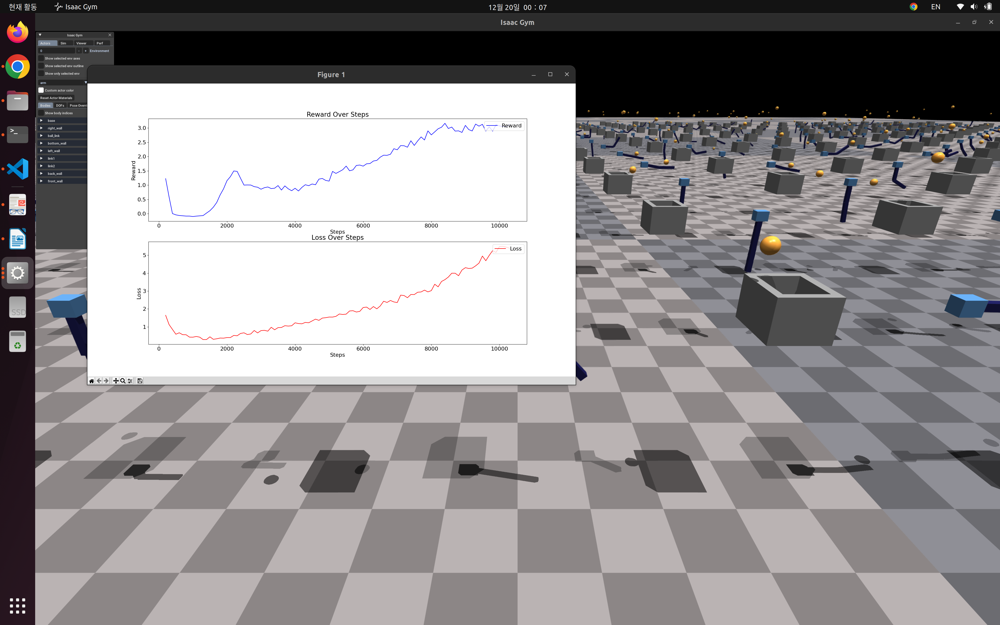
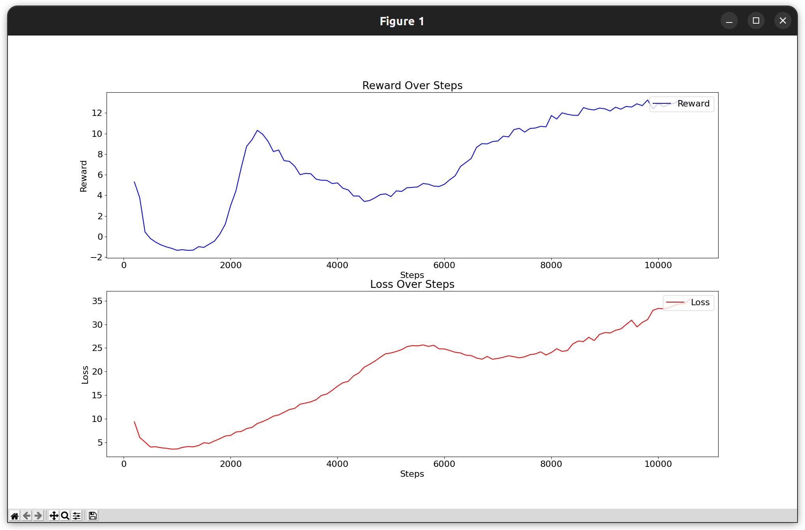
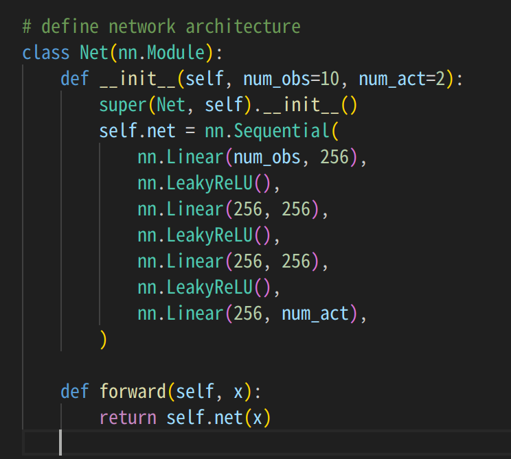
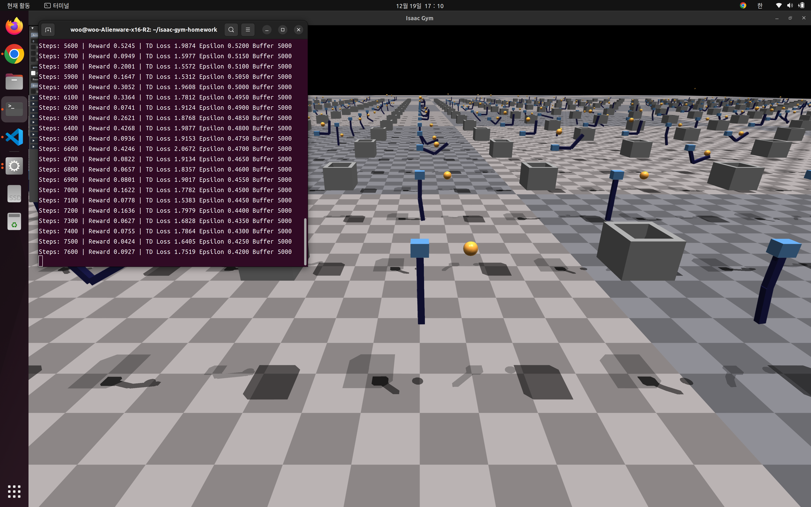

# Reinforcement Learning

> Course assignments for **Reinforcement Learning** (2024-2, Kwangwoon University)

A collection of reinforcement learning algorithm implementations, progressing from tabular methods to deep RL with GPU-accelerated physics simulation.

## Repository Structure

```
reinforcement-learning/
├── 1-policy-iteration/              # Policy Iteration on Grid World
│   ├── policy_iteration.py
│   ├── environment.py
│   └── img/
├── 2-sarsa-q-learning/              # SARSA & Q-Learning on Grid World
│   ├── sarsa/
│   │   ├── agent.py
│   │   └── environment.py
│   ├── q-learning/
│   │   ├── agent.py
│   │   └── environment.py
│   └── img/
└── 3-isaac-gym-dqn/                 # DQN with IsaacGym (Term Project)
    ├── trainer.py
    ├── agents/
    ├── envs/
    ├── utils/
    ├── assets/
    └── docs/
```

---

## 1. Policy Iteration

10x10 grid world with 24 obstacles. The agent finds an optimal path to the goal using iterative policy evaluation and greedy policy improvement.

- **Grid**: 10x10 with 24 obstacles (reward: -1) and 1 goal (reward: +1)
- **Algorithm**: Policy Evaluation (Bellman expectation) + Policy Improvement (greedy)
- **Discount factor comparison**: γ = 0, 0.5, 0.9



```bash
cd 1-policy-iteration
python policy_iteration.py
```

> Based on [reinforcement-learning-kr](https://github.com/rlcode/reinforcement-learning-kr)

---

## 2. SARSA & Q-Learning

7x7 grid world with 7 obstacles and 2 destinations. Compares on-policy (SARSA) vs off-policy (Q-Learning) TD control methods.

- **Grid**: 7x7 with 7 obstacles (reward: -10) and 2 destinations (reward: +100)
- **Epsilon decay**: ε starts at 1.0 and decreases by 0.01 per episode to 0.1
- **Key difference**: SARSA learns from the action actually taken (on-policy), Q-Learning learns from the best possible action (off-policy)

| SARSA | Q-Learning |
|:---:|:---:|
|  |  |

```bash
# SARSA
cd 2-sarsa-q-learning/sarsa
python agent.py

# Q-Learning
cd 2-sarsa-q-learning/q-learning
python agent.py
```

> Based on [reinforcement-learning-kr](https://github.com/rlcode/reinforcement-learning-kr)

---

## 3. Isaac Gym DQN (Term Project)

Deep Q-Network agents trained in NVIDIA Isaac Gym parallel simulation environments. Two robotic control tasks with 512 parallel environments on GPU.



### CartPole

A cart-pole system where the agent applies horizontal force to keep the pole balanced upright. Observation space: 4 values (cart position/velocity, pole angle/velocity). Action space: discretized into 2 bins.



### Basketball Arm

A 2-DOF robotic arm that learns to throw a ball toward a goal position at `(0, 3, 3)`. Observation space: 10-dimensional (joint positions/velocities, ball position/velocity). Action: continuous torque in `[-50, 50]` for each joint.



### Network Architecture

```
Input (obs_dim) → Linear(256) → LeakyReLU → Linear(256) → LeakyReLU → Linear(act_dim)
```

- Target network with soft update (τ = 0.995)
- Experience replay buffer (capacity: 5000 steps × 512 envs)
- ε-greedy exploration with linear decay



### Training

Training runs in real-time with the Isaac Gym viewer. Press `V` to toggle rendering on/off.



### Usage

```bash
cd 3-isaac-gym-dqn

# CartPole
python trainer.py --method dqn_cartpole

# Basketball Arm
python trainer.py --method dqn_basketball

# Options
python trainer.py --method dqn_cartpole --num_envs 1024 --sim_device cuda:0 --headless
```

### Requirements

- Python 3.8+, NVIDIA GPU with CUDA
- [NVIDIA Isaac Gym Preview 4](https://developer.nvidia.com/isaac-gym)
- `pip install torch numpy pygame`

> Based on [kdyy1111/isaac-gym-homework](https://github.com/kdyy1111/isaac-gym-homework)

---

## Acknowledgments

- [reinforcement-learning-kr](https://github.com/rlcode/reinforcement-learning-kr) for Policy Iteration, SARSA, Q-Learning base code
- [kdyy1111/isaac-gym-homework](https://github.com/kdyy1111/isaac-gym-homework) for the IsaacGym DQN framework
- [NVIDIA Isaac Gym](https://developer.nvidia.com/isaac-gym) for GPU-accelerated physics simulation
- [IsaacGymEnvs](https://github.com/NVIDIA-Omniverse/IsaacGymEnvs) for the reference CartPole implementation
